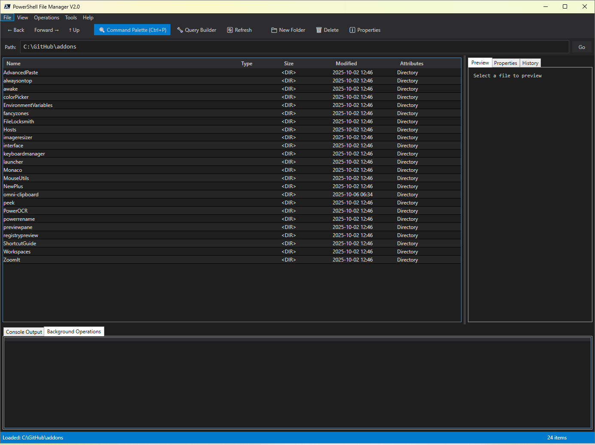

# PowerShell File Manager

A command-centric file manager built with PowerShell 7, featuring rich GUI integration, advanced file operations, and extensive PowerShell scripting capabilities.


## Features

### Command-Centric Design

- ✅ **Command Palette** (Ctrl+P): Primary interface accepting natural language and PowerShell syntax
- ✅ **Enhanced Natural Language Processing**: Smart command interpretation with fuzzy matching
- ✅ **Query Builder**: Visual interface for constructing complex file searches
- ✅ **Script Workspace**: Dedicated environment for PowerShell scripts with syntax highlighting
- ✅ **Live Command Preview**: See generated PowerShell commands as you interact with the GUI
- ✅ **Intelligent Suggestions**: Context-aware command and search suggestions based on usage history

### Rich Metadata Display

- ✅ **Object Inspector**: Expandable property panel showing all file metadata
- ✅ **Customizable Columns**: Add any file property as a column
- ✅ **Live Property Editing**: In-place metadata editing with validation
- ✅ **EXIF/ID3 Support**: Rich metadata for images and media files
- ✅ **Comprehensive File Indexing**: Lightning-fast metadata caching with automatic refresh cycles

### Advanced Search Capabilities

- ✅ **Fuzzy Search**: Industry-standard Levenshtein distance algorithm for typo-tolerant searching
- ✅ **Intelligent Search Suggestions**: AI-powered suggestions based on search history and file patterns
- ✅ **Regex Search**: Pattern-based file searching with advanced regex support
- ✅ **Content Search**: Search inside file contents with full-text indexing
- ✅ **Saved Searches**: Reusable search queries as PowerShell scripts
- ✅ **Search History**: Persistent search tracking with frequency analysis and intelligent ranking
- ✅ **Performance Optimized**: Sub-millisecond search results using cached file indexes
- ✅ **Similarity Scoring**: Configurable match thresholds with real-time confidence percentages

### High-Performance Operations

- ✅ **Enhanced Background Operations**: Professional-grade async file operations with runspace pooling
- ✅ **Robocopy Integration**: Enterprise-level file copying with progress tracking and reliability
- ✅ **Real-Time Progress Reporting**: Live transfer speeds, ETA calculations, and completion percentages
- ✅ **Concurrent Operation Management**: Handle multiple file operations simultaneously without resource conflicts
- ✅ **Operation Queue**: Visual queue with pause/resume controls and detailed status monitoring
- ✅ **Smart Resource Management**: Automatic cleanup and memory optimization for long-running operations

### Caching & Performance

- ✅ **Intelligent File Indexing**: Comprehensive metadata caching for instant search results
- ✅ **Concurrent Dictionary Storage**: Thread-safe, high-performance data structures
- ✅ **Automatic Cache Management**: 30-minute refresh cycles with smart expiry and cleanup
- ✅ **Memory Optimization**: Automatic garbage collection and resource management
- ✅ **Performance Analytics**: Up to 10x faster searches on large directory structures
- ✅ **Cache Statistics**: Detailed metrics on hit rates, coverage, and memory usage

### Advanced Batch Operations

- ✅ **Template-Based Actions**: Pre-built operation templates for common tasks
- ✅ **Multi-Step Workflows**: Chain operations with conditional logic
- ✅ **Smart Batch Processing**: Intelligent file grouping and parallel processing
- ✅ **Operation History**: Complete audit trail of all file operations
- ✅ **Conditional Operations**: Execute operations based on file properties and conditions

### PowerShell Integration

- ✅ **Runspace Manager**: Manage multiple PowerShell sessions with resource pooling
- ✅ **Variable Explorer**: View and reference PowerShell variables
- ✅ **Output Streams**: Separate panes for verbose, debug, warning, and error output
- ✅ **Module Support**: Import and manage PowerShell modules dynamically
- ✅ **Enhanced Error Handling**: Comprehensive error reporting with detailed stack traces and recovery suggestions

### Core File Operations

- ✅ **Batch rename** (regex-based with preview)
- ✅ **File permissions/ACL** viewer and editor
- ✅ **Duplicate file finder** (by hash, name, or size with progress tracking)
- ✅ **Archive support** (ZIP, TAR, 7z with compression options)
- ✅ **File comparison** (diff viewer with syntax highlighting)
- ✅ **Checksum calculator** (MD5, SHA256, SHA512 with batch processing)
- ✅ **Symlink/junction** creator with validation
- ✅ **Safe delete** with recycle bin integration
- ✅ **Directory synchronization** with intelligent comparison and WhatIf preview
- ✅ **Enhanced file preview** for 15+ formats with rich metadata extraction

### Enhanced File Preview System

- ✅ **Multi-Format Support**: Preview documents (.docx), spreadsheets (.xlsx), PDFs, videos (.mp4/.avi/.mkv), audio (.mp3/.wav/.flac), SVG graphics, Markdown files, STL 3D models, and G-code
- ✅ **Smart Format Detection**: Automatic file type detection with specialized handlers for each format
- ✅ **Rich Metadata Extraction**: Document statistics, ID3 tags, EXIF data, codec information, and file properties
- ✅ **Dual-Mode Operation**: Uses COM objects (Word/Excel) when available, falls back to native extraction methods
- ✅ **FFprobe Integration**: Detailed video/audio analysis including codecs, bitrates, resolution, and stream information
- ✅ **Document Preview**: Shows pages, words, characters, paragraphs, title, author, and content preview for Word documents
- ✅ **Spreadsheet Preview**: Displays worksheet names, dimensions, data preview, and workbook metadata for Excel files
- ✅ **PDF Metadata**: Extracts PDF version, page count, title, author, subject, and creator information
- ✅ **Video Information**: Resolution, frame rate, duration, codecs, bitrate, and audio/video stream details
- ✅ **Audio Tags**: ID3 tags (title, artist, album, genre), duration, bitrate, sample rate, and channels
- ✅ **SVG Preview**: Parse SVG structure, show dimensions, viewBox, element counts (paths, circles, rectangles), detect CSS/JavaScript
- ✅ **Markdown Preview**: Count headings, links, images, code blocks, extract table of contents, show content preview
- ✅ **STL Preview**: Detect binary/ASCII format, show triangle/vertex counts, validate file integrity, categorize model complexity
- ✅ **G-code Preview**: Parse 3D print metadata, layer counts, temperatures, filament usage, slicer info, print time estimates
- ✅ **Fallback Mechanisms**: Graceful degradation when optional dependencies are missing
- ✅ **Natural Language Commands**: "preview svg", "preview markdown", "preview 3d model", "preview gcode", etc.
- ✅ **Error Handling**: Comprehensive error messages with helpful tips for installing optional dependencies

### PowerToys Integration

- ✅ **File Locksmith**: Identify which processes are locking files using Windows Restart Manager AP
- ✅ **Always On Top**: Pin any window to stay on top of all other windows using Windows API
- ✅ **Image Resizer**: Batch image processing with resize, format conversion, and quality settings
- ✅ **Text Extractor (OCR)**: Extract text from images using Windows.Media.Ocr or Tesseract
- ✅ **Color Picker**: Interactive screen color picker with HEX/RGB/HSL/HSV format conversion
- ✅ **Hosts File Editor**: System hosts file management with backup/restore capabilities
- ✅ **Quick Accent**: Quick access to accented characters and special symbols
- ✅ **Keyboard Shortcut Guide**: Comprehensive keyboard shortcut reference for File Manager and Windows
- ✅ **Workspace Layouts**: Window arrangement and workspace management (FancyZones integration)
- ✅ **Template Manager**: Template-based file creation with variable substitution
- ✅ **Awake Mode**: Keep system awake during long operations with cross-platform support
- ✅ **PowerRename**: Advanced batch renaming with regex, case conversion, and numbering
- ✅ **GUI Integration**: All PowerToys features accessible via Tools > PowerToys menu
- ✅ **PowerShell Best Practices**: Proper parameter validation, ShouldProcess support, and comprehensive help

### Navigation & Productivity

- ✅ **Directory history** (back/forward navigation with breadcrumbs)
- ✅ **Quick filter** (real-time directory filtering with fuzzy matching)
- ✅ **Enhanced keyboard shortcuts** and command palette with customizable bindings
- ✅ **Intelligent folder size calculation** with background processing and caching
- ✅ **Advanced fuzzy path matching** with similarity scoring
- ✅ **Performance monitoring** with operation timing and resource usage metrics

### Integration Features

- ✅ **Enhanced Git integration** (status indicators, branch information, conflict detection)
- ✅ **Cloud storage sync status** (OneDrive, Dropbox with real-time updates)
- ✅ **FTP/SFTP** support with connection pooling
- ✅ **Advanced plugin system** for extensibility with proper interfaces and lifecycle management
- ✅ **Comprehensive logging system** with rotation, filtering, and structured error tracking

### Security & Reliability

- ✅ **ACL management and templates** with role-based permissions
- ✅ **Secure file wipe** (multi-pass delete with DoD standards)
- ✅ **Password-protected archives** with AES encryption
- ✅ **UAC elevation support** with seamless privilege escalation
- ✅ **Enhanced security features** with file encryption/decryption and digital signatures
- ✅ **Backup & recovery** with automatic backup before destructive operations and undo capabilities

#### Configuration & Settings Management

- ✅ **Centralized configuration** with FileManagerConfig class
- ✅ **Persistent settings** saved to JSON with automatic loading
- ✅ **Theme customization** and UI preferences
- ✅ **Key binding management** and preview settings

#### Performance & Monitoring

- ✅ **Performance metrics** tracking operation times and memory usage
- ✅ **Operation statistics** with execution counts and averages
- ✅ **Performance reports** exportable to JSON/CSV
- ✅ **Resource profiling** for bottleneck identification

#### File Integrity & Security

- ✅ **File integrity monitoring** with baseline hash generation
- ✅ **Secure file deletion** (DOD 5220.22-M compliant)
- ✅ **AES-256 file encryption** with password protection
- ✅ **Digital signatures** for file authentication
- ✅ **Integrity verification** against stored baselines

#### Smart Operations

- ✅ **Batch operation templates** for reusable workflows
- ✅ **Conditional batch operations** with if/then/else logic
- ✅ **Safe recycle bin deletion** on Windows
- ✅ **Recycle bin management** (list, restore, clear)

#### Advanced External Tool Integration

- ✅ **Tool registry system** for external applications
- ✅ **File type associations** with custom tools
- ✅ **Tool execution tracking** and statistics
- ✅ **Persistent tool configuration**

#### Health & Diagnostics

- ✅ **Health monitoring** for system resources and modules
- ✅ **Diagnostic data export** with sanitization options
- ✅ **Startup health checks** for configuration validation
- ✅ **Disk space monitoring** and warnings

#### Path & File Safety

- ✅ **Path normalization** and validation
- ✅ **Path traversal protection** and security checks
- ✅ **Symlink detection** and reparse point handling
- ✅ **Cross-platform path conversion** (Windows/Linux/macOS)

#### Enhanced Logging

- ✅ **Centralized logging** with rotation and filtering
- ✅ **Write-Log facade** with correlation IDs
- ✅ **Structured log entries** with metadata
- ✅ **Log analysis** and querying capabilities

## Requirements

- **PowerShell 7.0+** (PowerShell Core)
- **Windows 10/11** (or Windows Server 2016+) *for full GUI features*
- **Linux** (Ubuntu, Debian, RHEL, etc.) *for command-line features*
- **macOS** (10.13+) *for command-line features*
- **.NET Framework 4.7.2+** (for WPF GUI on Windows)



## Installation

### Option 1: Clone Repository

```powershell
git clone https://github.com/J-Ellette/PowerShellFileManager.git
cd PowerShellFileManager
Import-Module .\PowerShellFileManager.psd1
```

### Option 2: Import Module Directly

```powershell
Import-Module PowerShellFileManager
```

## Quick Start

### Launch the File Manager

```powershell
# Start the GUI application
Start-FileManager

# Start with a specific path
Start-FileManager -InitialPath "C:\MyFiles"
```

### Use Command Palette

```powershell
# Open command palette directly
Invoke-CommandPalette

# With initial query
Invoke-CommandPalette -InitialQuery "find large files"
```

### Build Queries Visually

```powershell
# Open query builder
New-QueryBuilder

# With specific path
New-QueryBuilder -InitialPath "C:\Data"
```

### Script Workspace

```powershell
# Open script workspace for PowerShell editing
New-ScriptWorkspace
```

## Usage Examples

### Find Duplicate Files

```powershell
# Find duplicates by hash
Find-DuplicateFiles -Path "C:\MyFiles" -Method Hash

# Find duplicates by name
Find-DuplicateFiles -Path "C:\MyFiles" -Method Name
```

### Batch Operations

```powershell
# Start batch copy
Get-ChildItem *.txt | Start-BatchOperation -Operation Copy

# Batch rename with regex
Rename-FileBatch -Path "C:\Files" -Pattern "old" -Replacement "new"
```

### File Analysis

```powershell
# Get folder size
Get-FolderSize -Path "C:\LargeFolder"

# Analyze disk space
Get-DiskSpace -Path "C:\" -Depth 3

# Calculate checksum
Get-FileChecksum -Path "file.iso" -Algorithm SHA256
```

### Directory Synchronization

```powershell
# Sync directories
Sync-Directories -Source "C:\Source" -Destination "D:\Backup" -Mode Mirror

# Preview changes with WhatIf
Sync-Directories -Source "C:\Source" -Destination "D:\Backup" -WhatIf
```

### Search Operations

```powershell
# Search files by pattern
Search-Files -Path "C:\Code" -Pattern "\.cs$"

# Search file contents
Search-Files -Path "C:\Docs" -Pattern "TODO" -ContentSearch

# Save search query
Save-SearchQuery -Name "FindLogs" -Query { Get-ChildItem -Filter "*.log" -Recurse }
```

### Archive Operations

```powershell
# Create archive
New-Archive -Path "C:\Files" -Destination "archive.zip" -Format ZIP

# Extract archive
Expand-Archive -Path "archive.zip" -Destination "C:\Extracted"

# List archive contents
Get-ArchiveContent -Path "archive.zip"
```

### Security Operations

```powershell
# View file ACL
Get-FileACL -Path "C:\SecureFile.txt"

# Set file permissions
Set-FileACL -Path "C:\File.txt" -Principal "DOMAIN\User" -Rights Read -Type Allow

# Secure delete
Remove-SecureFile -Path "sensitive.txt" -Passes 7
```

### Git Integration

```powershell
# Get git status
Get-GitStatus -Path "C:\MyRepo"

# Show diff
Invoke-GitDiff -File "README.md"
```

### PowerToys Features

```powershell
# Image Resizer - Batch resize images
Resize-Image -Path "photo.jpg" -Width 800 -KeepAspectRatio

# Text Extractor (OCR) - Extract text from screen
Start-ScreenTextExtractor

# Color Picker - Pick color from screen
Get-ColorFromScreen -Format HEX

# Hosts File Editor - Manage system hosts file
Get-HostsEntry
Add-HostsEntry -IPAddress "127.0.0.1" -Hostname "local.test"
Remove-HostsEntry -Hostname "local.test"

# PowerRename - Advanced batch renaming
Invoke-PowerRename -Path "C:\Photos" -Find "IMG_" -Replace "Photo_"

# Awake Mode - Keep system awake
Enable-AwakeMode -Duration 3600  # Keep awake for 1 hour

# Workspace Layouts - Manage window arrangements
Save-WorkspaceLayout -Name "Development"
Apply-WorkspaceLayout -Name "Development"

# Template Manager - Create files from templates
New-FileFromTemplate -Template "PowerShellScript" -Path "script.ps1"
```

### Network Operations

```powershell
# Connect to FTP
Connect-FTP -Server "ftp.example.com"

# Connect to SFTP
Connect-SFTP -Server "sftp.example.com" -Port 22
```

### Object Inspection

```powershell
# Inspect file properties
Show-ObjectInspector -Path "C:\file.txt"

# Inspect any PowerShell object
Get-Process | Select-Object -First 1 | Show-ObjectInspector
```

### Metadata Editing

```powershell
# Edit file metadata
Edit-FileMetadata -Path "file.txt" -Properties @{
    ReadOnly = $true
    Hidden = $false
    CreationTime = "2025-01-01"
}
```

### NEW: Advanced Features

#### File Encryption and Security

```powershell
# Encrypt a file with password
Protect-FileWithPassword -FilePath "C:\secret.txt" -Password "MySecurePass"

# Decrypt an encrypted file
Unprotect-FileWithPassword -FilePath "C:\secret.txt.encrypted" -Password "MySecurePass"

# Digitally sign a file
$cert = Get-ChildItem Cert:\CurrentUser\My | Where-Object {$_.Subject -like "*Code*"}
Set-FileDigitalSignature -FilePath "C:\script.ps1" -Certificate $cert

# Verify digital signature
Test-FileDigitalSignature -FilePath "C:\script.ps1"
```

#### File Integrity Monitoring

```powershell
# Enable integrity monitoring for a directory
Enable-IntegrityMonitoring -Path "C:\Important" -Algorithm SHA256 -Recurse

# Verify file integrity against baseline
Test-FileIntegrity -Path "C:\Important"

# Securely delete a file (DOD standard)
Remove-FileSecurely -FilePath "C:\sensitive.doc" -Passes 7 -VerifyDeletion
```

#### Batch Operations with Templates

```powershell
# Create a batch operation template
$operations = @(
    @{Type='Copy'; Destination='C:\Backup'},
    @{Type='Compress'; Format='ZIP'; Destination='C:\Archives'}
)
New-BatchOperationTemplate -Name "BackupAndArchive" -Operations $operations

# Use conditional batch operations
$files = Get-ChildItem C:\Files
Start-ConditionalBatchOperation -Files $files `
    -Condition {$_.Length -gt 10MB} `
    -ThenOperation @{Type='Move'; Destination='C:\Large'} `
    -ElseOperation @{Type='Move'; Destination='C:\Small'}
```

#### Performance Monitoring

```powershell
# Track performance of an operation
$tracker = Start-PerformanceTracking -Operation "FileCopy"
# ... perform operation ...
Stop-PerformanceTracking -Tracker $tracker -ItemsProcessed 100

# Get performance metrics
Get-FileManagerMetrics -Last 50

# Get operation statistics
Get-OperationStatistics

# Display performance summary
Show-PerformanceSummary

# Export performance report
Export-PerformanceReport -OutputPath "C:\Reports\perf.json" -Format JSON
```

#### Health Monitoring

```powershell
# Check File Manager health
Get-FileManagerHealth

# Export diagnostic data
Export-DiagnosticData -OutputPath "C:\Diagnostics\bundle.zip" -SanitizeSensitiveData

# Run startup health checks
Test-StartupHealth
```

#### External Tool Integration

```powershell
# Register an external tool
Register-ExternalTool -Name "VS Code" `
    -Command "code {file}" `
    -FileTypes @("*.ps1", "*.txt", "*.json")

# Execute external tool on file
Invoke-ExternalTool -Name "VS Code" -FilePath "C:\script.ps1"

# List registered tools
Get-ExternalTool

# Update tool configuration
Update-ExternalTool -Name "VS Code" -Command "code -r {file}"

# Unregister tool
Unregister-ExternalTool -Name "VS Code"
```

#### Safe File Operations

```powershell
# Safe deletion with Recycle Bin (Windows)
Remove-ItemToRecycleBin -Path "C:\file.txt"

# List Recycle Bin contents
Get-RecycleBinItems

# Restore from Recycle Bin
Restore-RecycleBinItem -Name "file.txt"

# Empty Recycle Bin
Clear-RecycleBin

# Normalize and validate paths
$safePath = Resolve-NormalizedPath -Path ".\..\..\file.txt"

# Check if path is safe
Test-SafePath -Path "C:\Users\Documents\file.txt" -RequireExists

# Detect symlinks and junctions
Test-ReparsePoint -Path "C:\Link"
Get-ReparsePointTarget -Path "C:\Link"

# Convert path formats
Convert-PathFormat -Path "C:\Users\John" -TargetOS Linux  # Returns /mnt/c/Users/John
```

#### Configuration Management

```powershell
# Get current configuration
$config = Get-FileManagerConfig

# Update configuration
Set-FileManagerConfig -Theme "Light" -MaxCacheSize 200MB -Save

# Reset to defaults
Reset-FileManagerConfig
```

## Customization

### Themes

- The file manager uses a dark theme by default. Theme customization is available through the configuration system.

### Plugins

- Create custom plugins by placing `.psm1` files in the `Plugins` directory:

```powershell
# List available plugins
Get-PluginList

# Install a plugin
Install-Plugin -Path "C:\MyPlugin.psm1"

# Uninstall a plugin
Uninstall-Plugin -Name "MyPlugin"
```

## Keyboard Shortcuts

| Shortcut | Action |
|----------|--------|
| `Ctrl+P` | Open Command Palette |
| `F5` | Refresh current directory |
| `Backspace` | Navigate to parent directory |
| `Alt+←` | Navigate back |
| `Alt+→` | Navigate forward |
| `Del` | Delete selected items |
| `F2` | Rename selected item |
| `Ctrl+A` | Select all items |

## Architecture

PowerShellFileManager/
├── PowerShellFileManager.psd1       # Module manifest
├── PowerShellFileManager.psm1       # Root module
├── src/
│   ├── Modules/
│   │   ├── Core/                    # Core functionality
│   │   │   ├── CommandPalette.psm1
│   │   │   ├── QueryBuilder.psm1
│   │   │   ├── ScriptWorkspace.psm1
│   │   │   ├── ObjectInspector.psm1
│   │   │   └── RunspaceManager.psm1
│   │   ├── FileOperations/          # File operations
│   │   │   ├── BatchOperations.psm1
│   │   │   ├── FileManagement.psm1
│   │   │   └── ArchiveOperations.psm1
│   │   ├── Navigation/              # Navigation features
│   │   │   ├── NavigationHistory.psm1
│   │   │   └── QuickFilter.psm1
│   │   ├── Search/                  # Search functionality
│   │   │   ├── AdvancedSearch.psm1
│   │   │   └── DiskAnalyzer.psm1
│   │   ├── Integration/             # External integrations
│   │   │   ├── GitIntegration.psm1
│   │   │   ├── CloudIntegration.psm1
│   │   │   └── NetworkIntegration.psm1
│   │   ├── Preview/                 # Preview and metadata
│   │   │   ├── PreviewProviders.psm1
│   │   │   └── MetadataEditor.psm1
│   │   ├── Security/                # Security operations
│   │   │   └── SecurityOperations.psm1
│   │   └── System/                  # System features
│   │       ├── BackgroundOperations.psm1
│   │       └── PluginSystem.psm1
│   ├── Scripts/
│   │   └── Start-FileManager.ps1    # Main application
│   ├── UI/
│   │   ├── Controls/                # Custom UI controls
│   │   ├── Views/                   # View templates
│   │   └── Themes/                  # Theme files
│   └── Resources/
│       ├── Icons/                   # Icon files
│       ├── Themes/                  # Theme resources
│       └── Localization/            # Language files
└── Plugins/                         # User plugins

---

## Contributing

Contributions are welcome! Please feel free to submit a Pull Request.

1. Fork the repository
2. Create your feature branch (`git checkout -b feature/AmazingFeature`)
3. Commit your changes (`git commit -m 'Add some AmazingFeature'`)
4. Push to the branch (`git push origin feature/AmazingFeature`)
5. Open a Pull Request

## License

This project is licensed under the MIT License - see the [LICENSE](LICENSE) file for details.

## Acknowledgments

- Built with PowerShell 7 and Windows Presentation Foundation (WPF)
- Inspired by modern file managers and PowerShell's extensibility
- Community contributions and feedback

## Documentation

- **[EXAMPLES.md](docs/EXAMPLES.md)** - File Manager usage examples
- **[GETTING_STARTED.md](docs/GETTING_STARTED.md)** - Getting started guide
- **[QUICK_REFERENCE.md](docs/QUICK_REFERENCE.md)** - Quick reference guide
- **[USER_GUIDE.md](docs/USER_GUIDE.md)** - Comprehensive user guide for GUI features

## Support

**Issues**: [GitHub Issues](https://github.com/J-Ellette/PowerShellFileManager/issues)
**Discussions**: [GitHub Discussions](https://github.com/J-Ellette/PowerShellFileManager/discussions)
